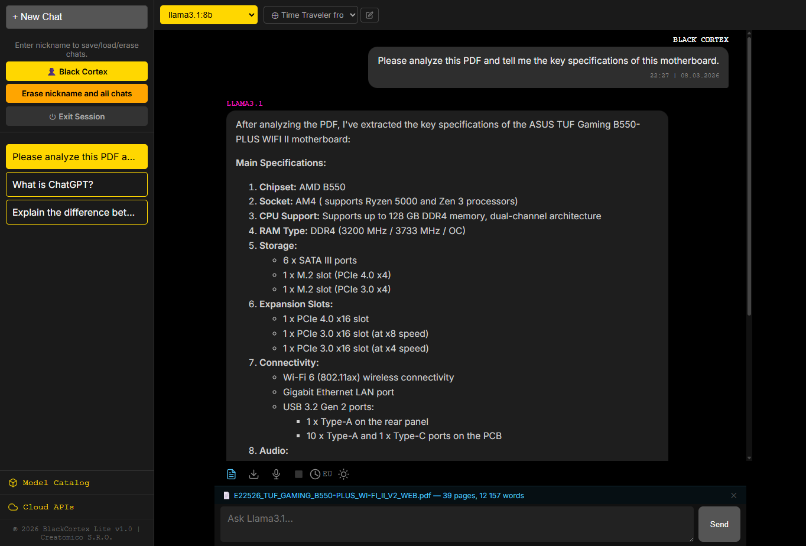
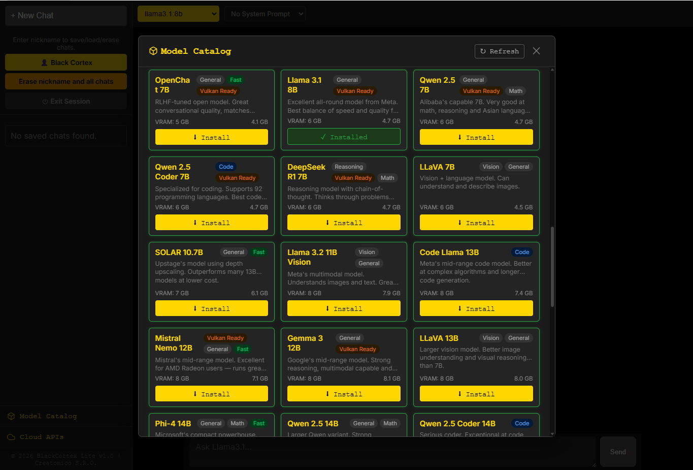
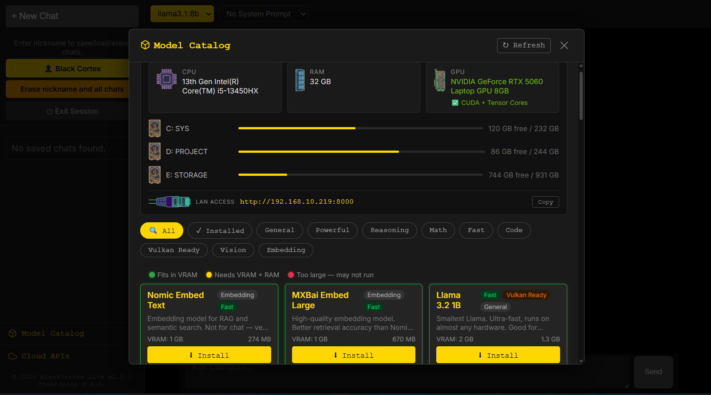
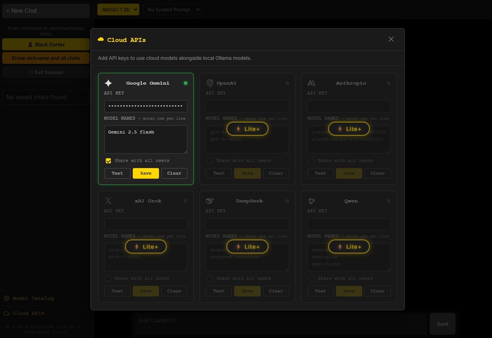
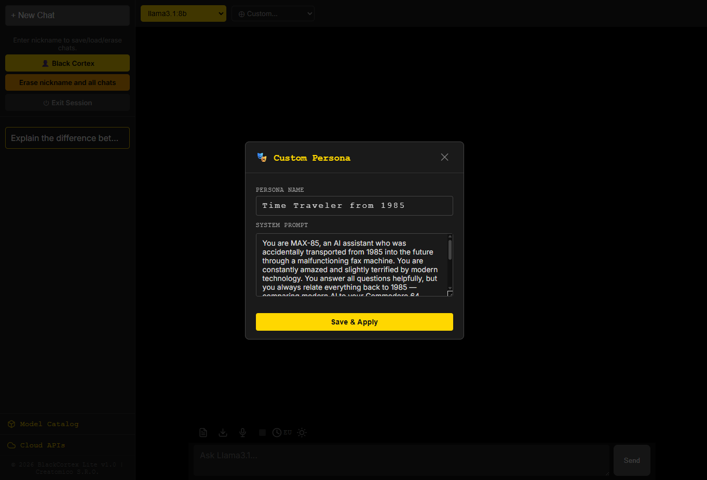
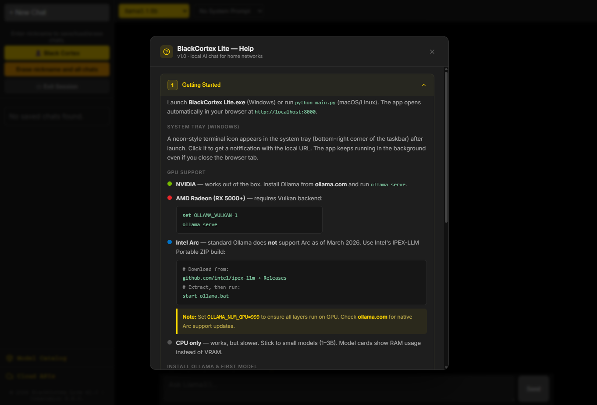

# BlackCortex Lite

**Local AI chat for home networks**

BlackCortex Lite is a self-hosted, multi-user AI chat application that runs entirely on your machine — no cloud, no subscriptions, no data leaving your network.

Built for home use. Connect everyone on your LAN, share one machine, keep full control of your data.

> ⚠ **Designed for trusted home networks only.** Not recommended for public or corporate deployment — no SSL encryption, no role-based access control, no audit logging.

---

## Screenshots

*PDF analysis — ask questions about any document*

*Model Catalog — AMD Vulkan Ready, hardware compatibility scoring*

*Model Catalog — NVIDIA CUDA + Tensor Cores*

*Cloud APIs — Google Gemini free, Lite+ unlocks more*

*Custom Persona — give your AI a name and personality*

*Built-in Help — 9 sections, always available*

---

## Features

- 🖥️ **Runs locally** — powered by Ollama, no internet required for local models
- 👥 **Multi-user** — each person gets their own chat history and settings
- 🌐 **LAN access** — anyone on the network connects via browser, no install needed
- 🤖 **Model Catalog** — browse and install Ollama models with hardware compatibility scoring
- ☁️ **Cloud APIs** — Google Gemini support in free tier (Lite+ unlocks more)
- 📄 **PDF chat** — attach documents and ask questions about them
- 🎤 **Voice input** — dictate messages on mobile and local desktop
- 🔒 **PIN protection** — model install/delete protected from accidental changes
- 🌙 **Dark UI** — gold accent, built for extended use

---

## Hardware Support

| GPU | Status |
|-----|--------|
| NVIDIA | ✅ Native |
| AMD | ✅ Vulkan (`OLLAMA_VULKAN=1`) |
| Intel Arc | ⚠️ Via IPEX-LLM |
| CPU only | ✅ Supported (slower) |

---

## Requirements

- Windows 10/11
- [Ollama](https://ollama.com) installed
- macOS and Linux versions coming soon

---

## Download

👉 **[black-cortex.com](https://www.black-cortex.com/)** — latest release, changelog, and install guide.

---

## Editions

| | **Lite** (Free) | **Lite+** |
|---|---|---|
| Local Ollama models | ✅ | ✅ |
| Google Gemini | ✅ | ✅ |
| OpenAI, Claude, xAI, DeepSeek, Qwen | ❌ | ✅ |
| Web search | ❌ | ✅ |
| Document analysis | ❌ | ✅ |
| Updates | ❌ | ✅ |

---

## Contact

📧 hello@black-cortex.com
🌐 [black-cortex.com](https://www.black-cortex.com/)

---

## License

Copyright © 2026 Creatomico LLC. All rights reserved.

This software is proprietary. Source code is not available for redistribution, modification, or commercial use without explicit written permission from Creatomico LLC.
